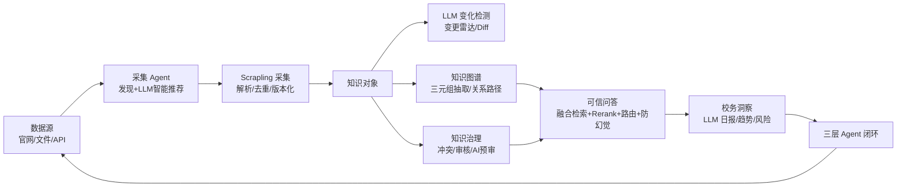

# 校务智汇中台 2.0（Campus Intelligence Hub）

> 面向高校校务管理的 **AI 自动数据采集与知识管理中台**。
> 赛道：第二届「庆园杯」AI 创新应用大赛 · 类别③ 面向校务管理的 AI 自动数据采集与知识管理中台。

---

## 📚 重要文档导航

- [README.md](README.md) · [COMPETITION_SUBMISSION.md](COMPETITION_SUBMISSION.md) · [DEMO_SCRIPT.md](DEMO_SCRIPT.md) · [EVAL_REPORT.md](EVAL_REPORT.md)
- [ENHANCEMENT_V3_SPEC.md](ENHANCEMENT_V3_SPEC.md) · [ARCHITECTURE.md](ARCHITECTURE.md) · [DECISIONS.md](DECISIONS.md) · [OSS_REUSE.md](OSS_REUSE.md)
- [scripts/demo.ps1](scripts/demo.ps1) · [scripts/eval_grounding.py](scripts/eval_grounding.py) · [eval/questions.json](eval/questions.json) · [backend/services/demo_seed.py](backend/services/demo_seed.py)

---

## 一句话定位

让高校校务信息**自动更新、可信可查、AI 可用**的一站式知识中台——不是聊天机器人，而是"校务知识的自动化数据中心"。

## 解决的痛点（教育领域真实场景）

| 痛点 | 表现 | 本方案回应 |
| --- | --- | --- |
| 散 | 通知/制度/办事流程散布在十几个部门官网 | 统一数据源 + AI 智能推荐采集 |
| 变 | 政策/截止日期频繁变动，人工盯不过来 | LLM 变化检测 + 变更雷达 + Diff |
| 旧 | 引用过期信息 | 新鲜度/时效评分 + 临期提醒 + 一键归档 |
| 乱 | 网传与官方不一，AI 无出处 | 证据引用 + Answer Guard 拒答 + 冲突消解 |
| 难复用 | 各 AI 应用重复爬 | 中台 API / MCP |

## 架构（一条数据流）

```
数据源(官网/文件/API)
   │  发现+智能推荐（LLM 选高价值源 + 采集频率）
   ▼
采集（Scrapling 微服务）
   │  解析→去重→版本化
   ▼
知识对象（KnowledgeObject）
   │  LLM 抽取：类型/部门/摘要/关键信息
   ├─► 变化检测 → 变更雷达 / Diff
   ├─► 知识图谱（LLM 三元组 → 关系路径 / GraphRAG）
   ├─► 冲突检测 / 审核队列 / AI 预审
   ▼
可信问答（融合检索 + Rerank + 意图/部门路由 + Answer Guard）
   ▼
校务洞察（LLM 日报 / 趋势 / 风险）+ 三层 Agent 闭环
```

**架构图**（Mermaid）：



## 功能矩阵

- **采集**：数据源管理 / 自动发现 / AI 智能推荐（Crawl4AI 式）/ 文件入库 / 定时任务
- **知识治理**：冲突检测 / 审核队列 / AI 审核助手（摘要+风险+推荐动作）/ 归档 / 知识健康度
- **知识图谱**：LLM 三元组抽取 / 力导向可视化（缩放/拖拽/节点点击）/ 关系路径问答 GraphsRAG / 类型筛选
- **可信问答**：融合评分检索 + gte-rerank-v2 精排 + 意图/部门路由 + 证据引用 + 防幻觉拒答
- **校务洞察**：LLM 日报/周报 / 趋势·风险·建议 / 自动定时推送
- **Agent 能力**：三层 Agent 智能闭环（采集→知识治理→问答/运营）/ AI 智能体中心
- **对外开放**：REST + MCP 工具（campus_search/source/knowledge/changes/review/insight/closed_loop，共 7 个）

## 一键部署

```bash
docker compose up -d --build
```
无本地模型/GPU，LLM/Embedding/Rerank 走 DashScope（可空 API Key 演示：Mock 降级，主链路永远可用）。

## 可信评测（A1，实测）

评测集 10 问（8 可作答 + 2 反例），`/api/v1/ask` 在 Rerank 开/关下对比：

| 指标 | Rerank 开 | Rerank 关 |
| --- | --- | --- |
| Grounded 率 | 100% | 100% |
| 证据引用一致性 | **87.5%** | 75.0% |
| 平均引用条数 | 3.20 | 3.20 |
| Answer Guard 反例拒答 | 50% | — |

脚本：`scripts/eval_grounding.py`（零依赖），报告：`EVAL_REPORT.md`。

## 技术栈

FastAPI · Next.js 14(App Router) · Qdrant(向量) · PostgreSQL(pgvector) · Redis · Scrapling(采集) · DashScope(qwen-plus / text-embedding-v3 / gte-rerank-v2) · ECharts · MCP。
